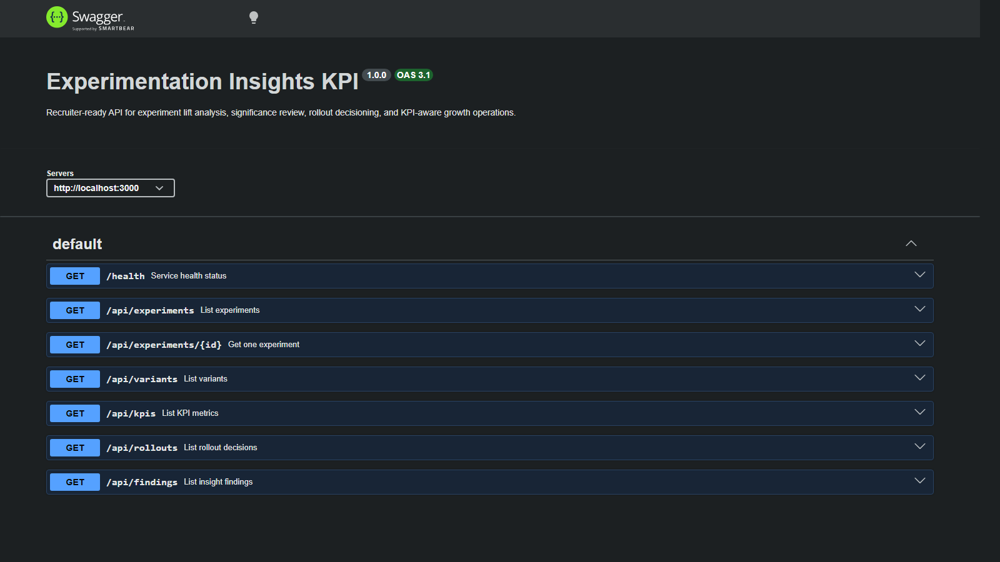
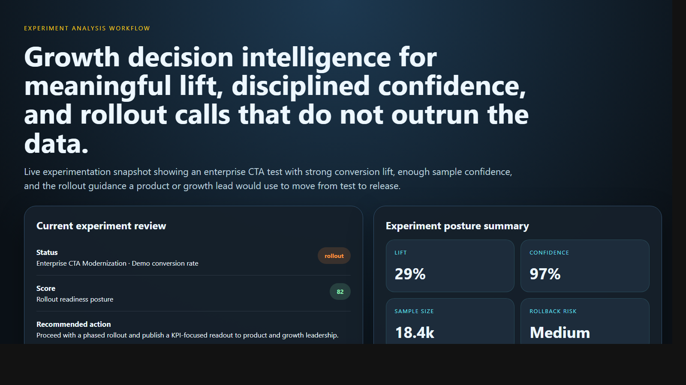
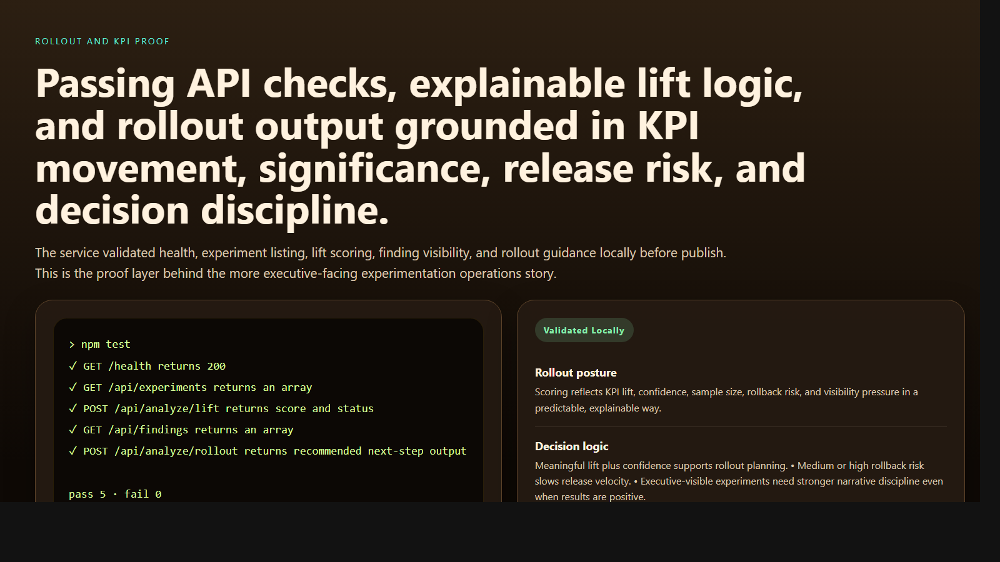

# Experimentation Insights KPI

> **TypeScript portfolio project** demonstrating experiment lift analysis, rollout decisioning, KPI interpretation, and growth-oriented backend decision support for enterprise teams.

**Recruiter takeaway:** *"This person understands experimentation as an operational decision system, not just a dashboard of percentages."*

---

## Project Overview

| Attribute | Detail |
|---|---|
| **Runtime** | Node.js + TypeScript |
| **Framework** | Express 5 |
| **Domain** | Experimentation, KPI interpretation, rollout governance |
| **Signal Areas** | Lift · Confidence · Sample size · Rollback risk · Executive visibility |
| **Operational Outputs** | Rollout posture · Significance review · Release guidance |
| **Docs** | Swagger UI at `/docs` |

---

## Executive Summary

Experimentation Insights KPI models the kind of internal system product, growth, revenue marketing, and leadership teams use to decide whether an experiment deserves broader release. Instead of reducing testing to a simple “won or lost” label, the API evaluates KPI lift, confidence, sample size, rollback risk, and the communication bar required for executive-visible experiments.

The result is a recruiter-facing backend project that feels like a realistic experimentation decision layer rather than a toy A/B test calculator.

---

## Business Problem

Experiment results are easy to misread when lift looks positive but the confidence bar is weak, the sample is still thin, or the release risk is higher than the headline KPI suggests. Teams need more than a stat sheet. They need an operational view of rollout readiness, experiment discipline, and executive reporting risk.

---

## Solution

This API turns experimentation posture into decision support. It models experiments, variants, KPI metrics, rollout decisions, and insight findings, then returns:

- lift-aware rollout scores
- significance and confidence guidance
- rollout prioritization
- dashboard-level experiment summary

---

## Architecture

```text
Experiment scenario or KPI readout
    |
    v
POST /api/analyze/*
    |
    +--> Request validation
    +--> Lift and baseline comparison
    +--> Confidence and sample-size review
    +--> Rollback risk and executive-visibility weighting
    |
    v
Rollout posture
    |
    +--> rollout
    +--> needs-review
    +--> hold
```

### Experiment Review Workflow

1. Teams submit an experiment scenario or query current experiments, variants, KPIs, and rollout decisions.
2. The service validates request shape with Zod.
3. Insight logic reviews relative lift, confidence level, sample size, rollback risk, and executive visibility.
4. The service returns a score, issues, passed checks, and a recommended next action.
5. Operators use dashboard, findings, and rollout views to coordinate readouts and release decisions.

---

## API Endpoints

| Method | Endpoint | Purpose |
|---|---|---|
| `GET` | `/health` | Service status and uptime |
| `GET` | `/api/experiments` | List experiments |
| `GET` | `/api/experiments/:id` | Fetch one experiment |
| `GET` | `/api/variants` | List variants |
| `GET` | `/api/kpis` | List KPI metrics |
| `GET` | `/api/rollouts` | List rollout decisions |
| `GET` | `/api/findings` | List experiment findings |
| `GET` | `/api/dashboard/summary` | Experimentation summary |
| `POST` | `/api/analyze/lift` | Analyze KPI lift |
| `POST` | `/api/analyze/significance` | Analyze significance posture |
| `POST` | `/api/analyze/rollout` | Analyze rollout decisioning |

---

## Sample Lift Request

```json
{
  "experimentName": "Enterprise CTA Modernization",
  "productArea": "Web Platform",
  "primaryKpi": "Demo conversion rate",
  "baselineConversionRate": 0.041,
  "variantConversionRate": 0.053,
  "sampleSize": 18420,
  "confidenceLevel": 0.97,
  "rollbackRisk": "medium",
  "executiveVisibility": true
}
```

## Sample Lift Response

```json
{
  "status": "rollout",
  "score": 82,
  "issues": [
    "Rollback risk should be reviewed before broader release.",
    "Executive visibility increases the bar for experiment-readout confidence and rollout discipline."
  ],
  "passedChecks": [
    "Variant lift is materially above the practical rollout threshold.",
    "Confidence level supports decision-making without additional holdout extension.",
    "Sample size is large enough to reduce rollout noise concerns."
  ],
  "recommendedNextAction": "Proceed with a phased rollout and publish a KPI-focused readout to product and growth leadership."
}
```

---

## Screenshots

### Hero Capture



### Experiment Analysis Workflow



### Rollout and KPI Proof



---

## Getting Started

### Prerequisites

- Node.js 20+
- npm

### Setup

```bash
git clone https://github.com/mizcausevic-dev/experimentation_insights_kpi.git
cd experimentation_insights_kpi
npm install
cp .env.example .env
npm run dev
```

Visit:

- `http://localhost:3000/docs`
- `http://localhost:3000/api/experiments`
- `http://localhost:3000/api/dashboard/summary`

### Run Tests

```bash
npm test
```

---

## What This Demonstrates

- experimentation translated into backend decision logic
- rollout governance instead of KPI-only reporting
- confidence, sample-size, and rollback-aware reasoning
- executive visibility and release discipline inside growth systems
- production-minded TypeScript API structure with docs, tests, and operational summaries

---

## Future Enhancements

- persist experiment outcomes and KPI history in PostgreSQL
- integrate feature-flag and analytics event feeds
- add downstream funnel quality and retention-weighted guardrails
- support phased rollouts, holdback groups, and exposure caps
- generate executive experiment readouts and governance summaries

---

## Tech Stack


### Portfolio Links

- [LinkedIn](https://www.linkedin.com/in/mirzacausevic)
- [Skills Page](https://mizcausevic.com/skills/)
- [Medium](https://medium.com/@mizcausevic)
- [GitHub](https://github.com/mizcausevic-dev)

---

*Part of [mizcausevic-dev's GitHub portfolio](https://github.com/mizcausevic-dev) — demonstrating experimentation systems thinking, rollout governance, and KPI-aware backend decisioning for enterprise growth operations.*
